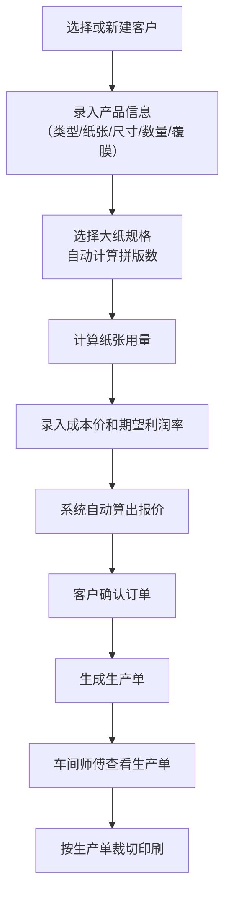

## 1. 产品概述
本系统是面向小型印刷店的订单管理与纸张开度计算工具，解决印刷店日常订单录入、纸张拼版计算、报价核算、生产单生成及客户历史查询等核心业务痛点。
- 目标用户：小型印刷店老板、前台接单员、车间师傅
- 核心价值：通过自动化拼版计算与报价系统，减少人工计算错误，提升接单效率

## 2. 核心功能

### 2.1 用户角色
| 角色 | 注册方式 | 核心权限 |
|------|----------|----------|
| 管理员/店主 | 系统初始账号 | 全部功能：订单管理、报价、生产单、客户查询、系统设置 |
| 接单员 | 管理员创建 | 订单录入、纸张计算、报价、客户查询 |
| 车间师傅 | 管理员创建 | 查看生产单、确认生产 |

### 2.2 功能模块
1. **仪表盘首页**：今日订单概览、月度收入统计、常用快捷入口
2. **订单管理**：新建订单、订单列表、订单详情、订单状态跟踪
3. **纸张开度计算**：自动拼版计算、纸张用量预估
4. **报价系统**：成本录入、利润设置、自动报价
5. **生产单管理**：生产单生成、生产单列表、打印预览
6. **客户管理**：客户信息维护、历史订单查询、消费统计

### 2.3 页面详情
| 页面名称 | 模块名称 | 功能描述 |
|----------|----------|----------|
| 仪表盘 | 数据概览卡片 | 今日订单数、待生产订单、本月收入、常用产品统计 |
| 仪表盘 | 快捷入口 | 新建订单、新建客户、生产单列表、客户查询 |
| 新建订单 | 客户信息区 | 选择/新建客户、联系方式录入 |
| 新建订单 | 产品信息区 | 产品类型（名片/宣传单/不干胶）、纸张类型、尺寸、数量、是否覆膜 |
| 新建订单 | 拼版计算区 | 选择大纸尺寸、自动计算拼版数量、显示纸张用量 |
| 新建订单 | 报价区 | 成本价、利润率、自动计算销售报价 |
| 新建订单 | 订单确认区 | 订单备注、确认生成订单/生产单 |
| 订单列表 | 筛选栏 | 按日期/客户/状态筛选、搜索 |
| 订单列表 | 订单表格 | 订单号、客户、产品、数量、金额、状态、操作 |
| 生产单详情 | 生产信息卡 | 客户信息、产品规格、拼版图示、裁切方式、特殊工艺 |
| 客户详情 | 基本信息 | 客户姓名、联系方式、备注 |
| 客户详情 | 历史订单 | 时间轴展示历史订单、订单统计、常印规格分析 |

## 3. 核心流程

### 3.1 接单到生产主流程

### 3.2 拼版计算逻辑

## 4. 用户界面设计

### 4.1 设计风格
- **主色调**：深蓝（#1E3A5F）- 专业、稳重；辅助色：琥珀橙（#F59E0B）- 警示、操作
- **按钮风格**：圆角矩形（8px）、主色填充、轻微阴影、悬停有深度变化
- **字体**：标题使用思源宋体（文艺印刷感），正文使用思源黑体（清晰易读）
- **布局风格**：左侧导航栏 + 右侧内容区，卡片式模块布局
- **图标风格**：线性图标，印刷相关图标（纸张、裁切、油墨等）

### 4.2 页面设计概述
| 页面名称 | 模块名称 | UI元素 |
|----------|----------|----------|
| 仪表盘 | 数据卡片 | 渐变背景卡片、大号数字、趋势箭头、图标装饰 |
| 新建订单 | 表单区域 | 分组折叠面板、动态计算提示、拼版预览示意图 |
| 生产单详情 | 生产信息 | 大尺寸裁切预览图、规格标签、步骤指示、打印按钮 |
| 客户详情 | 历史订单 | 时间轴节点、标签云展示常印规格、统计图表 |

### 4.3 响应式设计
- 桌面优先设计（≥1280px）
- 平板端（768-1279px）：侧栏收缩为图标，内容区自适应
- 移动端（<768px）：顶部导航，内容垂直堆叠，表单简化

### 4.4 特殊交互细节
- 拼版计算时显示可视化拼版示意图（格子排布）
- 报价计算带实时数字滚动动画
- 生产单裁切区域用虚线框标注
