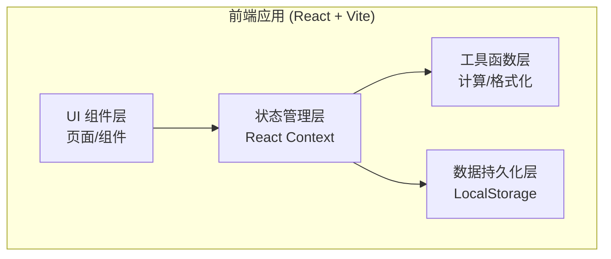
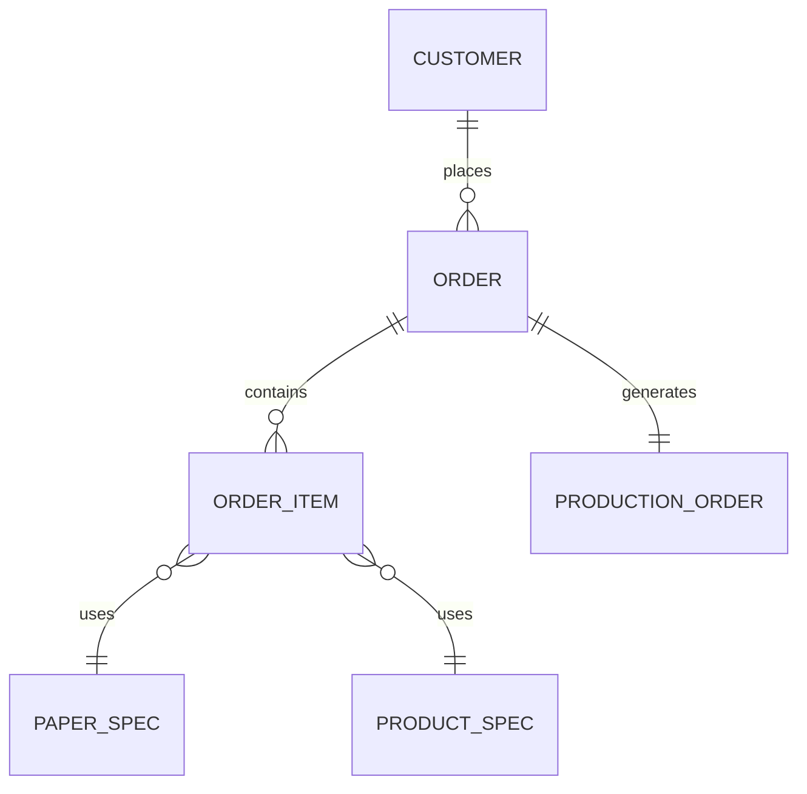

## 1. 架构设计



## 2. 技术描述
- **前端框架**：React@18 + TypeScript
- **构建工具**：Vite@5
- **样式方案**：TailwindCSS@3 + CSS变量
- **状态管理**：React Context + useReducer
- **图标库**：Lucide React
- **图表**：Recharts
- **数据存储**：LocalStorage（纯前端，无需后端）
- **UI组件**：Headless UI（弹窗、下拉等无样式组件）

## 3. 路由定义

| 路由路径 | 页面名称 | 用途 |
|----------|----------|------|
| / | 仪表盘首页 | 数据概览、快捷入口 |
| /orders | 订单列表 | 查看/筛选所有订单 |
| /orders/new | 新建订单 | 录入订单、计算拼版、报价 |
| /orders/:id | 订单详情 | 查看订单完整信息 |
| /production | 生产单列表 | 查看待生产/生产中订单 |
| /production/:id | 生产单详情 | 查看生产单、打印 |
| /customers | 客户列表 | 查看/管理客户 |
| /customers/:id | 客户详情 | 客户信息、历史订单、消费统计 |

## 4. 数据模型

### 4.1 ER图



### 4.2 数据结构定义

```typescript
// 客户
interface Customer {
  id: string;
  name: string;
  phone: string;
  email?: string;
  address?: string;
  remark?: string;
  createdAt: string;
}

// 产品类型
type ProductType = 'business_card' | 'flyer' | 'sticker';

// 纸张类型
type PaperType = 'coated' | 'matte' | 'uncoated' | 'special';

// 覆膜类型
type LaminationType = 'none' | 'gloss' | 'matte' | 'soft_touch';

// 纸张规格（大纸）
interface PaperSpec {
  id: string;
  name: string;          // 如 A3, A4, 大度纸, 正度纸
  width: number;         // mm
  height: number;        // mm
  unitPrice: number;     // 单张成本价
}

// 产品规格（成品）
interface ProductSpec {
  type: ProductType;
  name: string;          // 如 标准名片, A4宣传单
  width: number;         // mm
  height: number;        // mm
}

// 订单项
interface OrderItem {
  id: string;
  productType: ProductType;
  productName: string;
  paperType: PaperType;
  paperWeight: number;   // 克重 g/m²
  finishedWidth: number; // 成品宽 mm
  finishedHeight: number;// 成品高 mm
  quantity: number;      // 成品数量
  lamination: LaminationType;
  // 拼版计算结果
  parentPaperId: string;
  parentPaperName: string;
  parentWidth: number;
  parentHeight: number;
  layoutHorizontal: number;  // 横向拼版数
  layoutVertical: number;    // 纵向拼版数
  perSheetCount: number;     // 每张大纸出成品数
  sheetsNeeded: number;      // 所需大纸张数
  rotated: boolean;          // 是否旋转90°拼版
  // 成本与报价
  paperCost: number;         // 纸张成本
  printingCost: number;      // 印刷成本
  laminationCost: number;    // 覆膜成本
  otherCost: number;         // 其他成本
  totalCost: number;         // 总成本
  profitRate: number;        // 利润率 %
  unitPrice: number;         // 成品单价
  subtotal: number;          // 小计金额
}

// 订单状态
type OrderStatus = 'draft' | 'quoted' | 'confirmed' | 'in_production' | 'completed' | 'cancelled';

// 订单
interface Order {
  id: string;
  orderNo: string;
  customerId: string;
  customerName: string;
  customerPhone: string;
  items: OrderItem[];
  status: OrderStatus;
  remark?: string;
  totalAmount: number;
  createdAt: string;
  confirmedAt?: string;
  completedAt?: string;
}

// 生产单
interface ProductionOrder {
  id: string;
  orderId: string;
  orderNo: string;
  customerName: string;
  items: ProductionItem[];
  status: 'pending' | 'producing' | 'done';
  createdAt: string;
  assignedTo?: string;
}

interface ProductionItem {
  orderItemId: string;
  productName: string;
  paperSpec: string;        // 如 铜版纸300g
  finishedSize: string;     // 如 90×54mm
  parentSize: string;       // 如 A3 (420×297mm)
  layout: string;           // 如 5×2 = 10张/张
  quantity: number;
  sheetsNeeded: number;
  lamination: string;
  cuttingInstruction: string; // 裁切说明
  remark?: string;
}
```

## 5. 核心算法

### 5.1 拼版计算算法

```typescript
function calculateLayout(
  finishedW: number, finishedH: number,
  parentW: number, parentH: number,
  bleed: number = 3  // 出血位 mm
): {
  horizontal: number;
  vertical: number;
  perSheet: number;
  rotated: boolean;
} {
  const fw = finishedW + bleed * 2;
  const fh = finishedH + bleed * 2;
  
  // 正常方向
  const h1 = Math.floor(parentW / fw);
  const v1 = Math.floor(parentH / fh);
  const count1 = h1 * v1;
  
  // 旋转90°
  const h2 = Math.floor(parentW / fh);
  const v2 = Math.floor(parentH / fw);
  const count2 = h2 * v2;
  
  if (count2 > count1) {
    return { horizontal: h2, vertical: v2, perSheet: count2, rotated: true };
  }
  return { horizontal: h1, vertical: v1, perSheet: count1, rotated: false };
}
```

### 5.2 报价计算算法

```typescript
function calculatePricing(cost: number, profitRate: number): {
  unitPrice: number;
  total: number;
} {
  const multiplier = 1 + profitRate / 100;
  return {
    unitPrice: +(cost * multiplier / quantity).toFixed(2),
    total: +(cost * multiplier).toFixed(2)
  };
}
```

## 6. 项目结构

```
src/
├── types/              # TypeScript 类型定义
│   └── index.ts
├── context/            # Context 状态管理
│   ├── AppContext.tsx
│   └── reducer.ts
├── utils/              # 工具函数
│   ├── layout.ts       # 拼版计算
│   ├── pricing.ts      # 报价计算
│   ├── format.ts       # 格式化
│   └── storage.ts      # LocalStorage 操作
├── data/               # 初始数据/常量
│   ├── papers.ts       # 常用纸张规格
│   └── products.ts     # 常用产品规格
├── components/         # 可复用组件
│   ├── Layout/
│   │   ├── Sidebar.tsx
│   │   └── Header.tsx
│   ├── Order/
│   │   ├── OrderForm.tsx
│   │   ├── LayoutPreview.tsx  # 拼版预览
│   │   └── PricingPanel.tsx
│   ├── Production/
│   │   └── CuttingDiagram.tsx # 裁切示意图
│   └── common/
│       ├── DataCard.tsx
│       ├── Modal.tsx
│       └── Table.tsx
├── pages/              # 页面组件
│   ├── Dashboard.tsx
│   ├── OrderList.tsx
│   ├── OrderNew.tsx
│   ├── OrderDetail.tsx
│   ├── ProductionList.tsx
│   ├── ProductionDetail.tsx
│   ├── CustomerList.tsx
│   └── CustomerDetail.tsx
├── App.tsx
├── main.tsx
└── index.css
```
